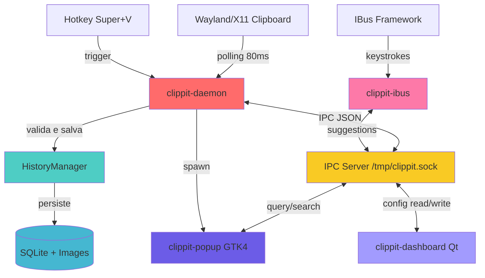

# Clippit-oud - Visão Geral do Projeto

## 📋 Descrição

**Clippit** é um gerenciador de área de transferência moderno, rápido e elegante para Linux (Wayland/X11) escrito em Rust. Oferece:

- 📋 Captura automática de texto e imagens
- 🖼️ Suporte completo a imagens com thumbnails
- 🔍 Busca inteligente em tempo real
- ⌨️ Atalho global configurável (Super+V padrão)
- 💾 Histórico persistente em SQLite
- 🎨 Interface moderna com GTK4 e libadwaita
- ⚡ Ultra rápido (~20MB RAM)
- 🚀 Autocomplete global enquanto você digita

## 🏗️ Arquitetura do Workspace

### Estrutura de Crates

```
Clippit (Cargo workspace - v1.9.4)
├── clippit-core       → 🧠 Biblioteca compartilhada (lógica de negócio)
├── clippit-daemon     → 👁️ Daemon principal (background service)
├── clippit-ipc        → 📡 Protocolo de comunicação inter-processos
├── clippit-popup      → 🎨 Interface popup (GTK4 + libadwaita)
├── clippit-dashboard  → ⚙️ Dashboard de configurações (Qt/QML)
├── clippit-ibus       → ⌨️ Engine IBus (autocomplete global)
├── clippit-qt-bridge  → 🔗 Bridge Rust-QML
└── clippit-tooltip    → 💬 Tooltips flutuantes
```

### Fluxo de Comunicação Principal



## 🎯 Responsabilidades por Crate

| Crate | Responsabilidade Principal | Tecnologias Chave | LOC |
|-------|---------------------------|-------------------|-----|
| **clippit-core** | Lógica de negócio compartilhada, configuração TOML, histórico SQLite, tipos | `rusqlite`, `serde`, `toml`, `chrono`, `sha2` | ~800 |
| **clippit-daemon** | Monitoramento de clipboard, hotkeys globais, IPC server, autocomplete | `tokio`, `arboard`, `global-hotkey`, `rdev` | ~1200 |
| **clippit-popup** | Interface de histórico, busca, navegação por teclado | `GTK4`, `libadwaita`, `gtk-rs` | ~1500 |
| **clippit-dashboard** | Configurações visuais (temas, hotkeys, privacidade) | `Qt6`, `QML`, `cxx-qt` | ~900 |
| **clippit-ipc** | Protocolo de mensagens, client/server IPC | `interprocess`, `serde_json` | ~400 |
| **clippit-ibus** | Captura de digitação, engine IBus via DBus | `zbus`, `zvariant`, `tokio` | ~600 |
| **clippit-qt-bridge** | Models Rust expostos para QML | `cxx-qt` | ~300 |
| **clippit-tooltip** | Popup flutuante para sugestões | `GTK4` | ~150 |

## 📂 Localização de Dados e Arquivos

### Dados do Usuário
- **Histórico**: `~/.local/share/clippit/history.db` (SQLite)
- **Imagens**: `~/.local/share/clippit/images/` (arquivos PNG com hash SHA256)
- **Config**: `~/.config/clippit/config.toml` (configurações TOML)

### Runtime
- **Socket IPC**: `/tmp/clippit.sock` (Unix Domain Socket)
- **Lock popup**: `/tmp/clippit-popup.lock` (PID do popup ativo)
- **Suggestions temp**: `/tmp/clippit-autocomplete-suggestions.txt`

### Sistema
- **Binários**: `/usr/local/bin/clippit-*`
- **Systemd**: `~/.config/systemd/user/clippit.service`
- **IBus component**: `/usr/share/ibus/component/clippit.xml`
- **Desktop entry**: `/usr/share/applications/clippit.desktop`

## 🔄 Fluxos de Dados Principais

### 1. Captura de Clipboard
```
[Usuário copia] → [Wayland/arboard] → [daemon/monitor.rs polling]
→ [Validação] → [Deduplicação SHA256] → [HistoryManager]
→ [SQLite INSERT] → [Imagem? salva arquivo]
```

### 2. Abertura do Popup
```
[Usuário: Super+V] → [daemon/hotkey.rs] → [Verifica lock file]
→ [Spawn clippit-popup] → [IPC QueryHistoryMetadata]
→ [daemon responde] → [popup renderiza lista GTK]
```

### 3. Autocomplete Global
```
[Usuário digita] → [IBus captura] → [clippit-ibus/engine.rs]
→ [IPC RequestAutocompleteSuggestions] → [daemon/typing_monitor.rs]
→ [Busca histórico] → [Retorna sugestões] → [Popup flutuante yad/tooltip]
→ [Tab aceita] → [xdotool injeta texto]
```

### 4. Busca em Tempo Real
```
[Usuário digita no SearchEntry] → [popup/views/search.rs]
→ [IPC SearchHistory {query}] → [daemon HistoryManager]
→ [SQLite LIKE query] → [Retorna matches] → [Atualiza ListBox]
```

## 🛠️ Stack Tecnológico

### Backend (Rust)
- **Runtime**: `tokio` 1.36 (async/await)
- **Database**: `rusqlite` 0.31 (SQLite bundled)
- **Serialization**: `serde` + `serde_json` + `toml`
- **Clipboard**: `arboard` 3.6 (Wayland-native via wl-clipboard-rs)
- **Hotkeys**: `global-hotkey` 0.7 (desktop portals)
- **Keyboard**: `rdev` 0.5 (global events)
- **IPC**: `interprocess` 2.0 (Unix sockets)
- **DBus**: `zbus` 4.0 (IBus engine)
- **Images**: `image` 0.25 (resize, thumbnails)
- **Crypto**: `sha2` 0.10 (deduplicação)

### Frontend
- **Popup**: GTK4 4.6+, libadwaita 1.2+ (Rust via `gtk-rs`)
- **Dashboard**: Qt6 + QML (Rust via `cxx-qt` 0.6)

### Build & Deploy
- **Workspace**: Cargo 1.70+
- **Packaging**: Scripts bash (.deb para Debian/Ubuntu)
- **CI**: GitHub Actions (futuro)

## 📐 Padrões Arquiteturais Utilizados

1. **Repository Pattern**: `HistoryManager` abstrai acesso ao SQLite
2. **Service Layer**: `clippit-core` como biblioteca compartilhada
3. **Client-Server**: Daemon como servidor, UIs como clientes via IPC
4. **Observer Pattern**: Monitors observam clipboard e hotkeys
5. **MVC/MVP**: Popup separa views, controllers, models
6. **Strategy Pattern**: Validação via `ContentValidator`
7. **Factory Pattern**: Construtors `new()` / `new_in_memory()`
8. **Singleton Pattern**: `HistoryManager` compartilhado via `Arc<Mutex<>>`

## 🎨 Design Principles

1. **Separation of Concerns**: Cada crate com responsabilidade única
2. **DRY**: Lógica compartilhada em `clippit-core`
3. **Error Handling**: `Result<T, E>` com `anyhow` e `thiserror`
4. **Type Safety**: Enums para estados, newtype patterns
5. **Async First**: Tokio para operações I/O
6. **Zero-Copy**: Referências quando possível
7. **Security**: Prepared statements, validação de inputs

## 🔗 Links para Rules Detalhadas

### Arquitetura e Padrões
- **Arquitetura Completa**: [01-ARCHITECTURE.md](./01-ARCHITECTURE.md)
- **Padrões de Desenvolvimento**: [02-DEVELOPMENT-STANDARDS.md](./02-DEVELOPMENT-STANDARDS.md)

### Core Library
- **Core Overview**: [core/CORE-OVERVIEW.md](./core/CORE-OVERVIEW.md)
- **Configuração**: [core/CONFIG-PATTERNS.md](./core/CONFIG-PATTERNS.md)
- **Histórico**: [core/HISTORY-STORAGE.md](./core/HISTORY-STORAGE.md)
- **Tipos**: [core/TYPES-DEFINITIONS.md](./core/TYPES-DEFINITIONS.md)
- **Validação**: [core/VALIDATION.md](./core/VALIDATION.md)

### Daemon
- **Daemon Overview**: [daemon/DAEMON-OVERVIEW.md](./daemon/DAEMON-OVERVIEW.md)
- **Monitor de Clipboard**: [daemon/MONITOR-CLIPBOARD.md](./daemon/MONITOR-CLIPBOARD.md)
- **Sistema de Hotkeys**: [daemon/HOTKEYS-SYSTEM.md](./daemon/HOTKEYS-SYSTEM.md)
- **Autocomplete**: [daemon/TYPING-AUTOCOMPLETE.md](./daemon/TYPING-AUTOCOMPLETE.md)
- **IPC Server**: [daemon/IPC-SERVER.md](./daemon/IPC-SERVER.md)

### User Interfaces
- **UI Overview**: [ui/UI-OVERVIEW.md](./ui/UI-OVERVIEW.md)
- **Popup GTK**: [ui/POPUP-GTK.md](./ui/POPUP-GTK.md)
- **Dashboard Qt**: [ui/DASHBOARD-QT.md](./ui/DASHBOARD-QT.md)
- **Tooltip**: [ui/TOOLTIP.md](./ui/TOOLTIP.md)
- **Padrões de UI**: [ui/UI-PATTERNS.md](./ui/UI-PATTERNS.md)

### Infraestrutura
- **Protocolo IPC**: [infrastructure/IPC-PROTOCOL.md](./infrastructure/IPC-PROTOCOL.md)
- **IBus Engine**: [infrastructure/IBUS-ENGINE.md](./infrastructure/IBUS-ENGINE.md)
- **Qt Bridge**: [infrastructure/QT-BRIDGE.md](./infrastructure/QT-BRIDGE.md)
- **Comunicação**: [infrastructure/COMMUNICATION.md](./infrastructure/COMMUNICATION.md)

### Features
- **Captura de Clipboard**: [features/CLIPBOARD-CAPTURE.md](./features/CLIPBOARD-CAPTURE.md)
- **Autocomplete Global**: [features/AUTOCOMPLETE-GLOBAL.md](./features/AUTOCOMPLETE-GLOBAL.md)
- **Busca e Sugestões**: [features/SEARCH-SUGGESTIONS.md](./features/SEARCH-SUGGESTIONS.md)
- **Manipulação de Imagens**: [features/IMAGE-HANDLING.md](./features/IMAGE-HANDLING.md)
- **Internacionalização**: [features/INTERNATIONALIZATION.md](./features/INTERNATIONALIZATION.md)

### Build & Deploy
- **Sistema de Build**: [build-deploy/BUILD-SYSTEM.md](./build-deploy/BUILD-SYSTEM.md)
- **Empacotamento**: [build-deploy/PACKAGING.md](./build-deploy/PACKAGING.md)
- **Instalação**: [build-deploy/INSTALLATION.md](./build-deploy/INSTALLATION.md)
- **Dependências**: [build-deploy/DEPENDENCIES.md](./build-deploy/DEPENDENCIES.md)

### Testing
- **Estratégia**: [testing/TESTING-STRATEGY.md](./testing/TESTING-STRATEGY.md)
- **Testes Unitários**: [testing/UNIT-TESTS.md](./testing/UNIT-TESTS.md)
- **Testes de Integração**: [testing/INTEGRATION-TESTS.md](./testing/INTEGRATION-TESTS.md)

## 📊 Métricas do Projeto

- **Total de LOC**: ~6000 linhas Rust + 500 QML
- **Crates**: 8 crates no workspace
- **Dependências**: 25 dependências principais
- **Linguagens**: Rust (95%), QML (3%), Bash (2%)
- **Plataformas**: Linux (Wayland/X11)
- **Licença**: MIT

## 🚀 Roadmap

- ✅ **v1.0**: MVP com clipboard básico
- ✅ **v1.9**: Autocomplete global
- 🔄 **v2.0**: IA para sugestões, OCR em imagens
- 🔮 **v3.0**: Sincronização cloud, mobile companion

## 📚 Documentação Adicional

- **README**: [/README.md](../README.md)
- **Contributing**: [/CONTRIBUTING.md](../CONTRIBUTING.md)
- **Development**: [/docs/DEVELOPMENT.md](../docs/DEVELOPMENT.md)
- **Autocomplete Implementation**: [/AUTOCOMPLETE_IMPLEMENTATION.md](../AUTOCOMPLETE_IMPLEMENTATION.md)
- **Roadmap**: [/ROADMAP.md](../ROADMAP.md)

---

**Versão das Rules**: 1.0  
**Última Atualização**: 2026-01-28  
**Mantido por**: Clippit Team
