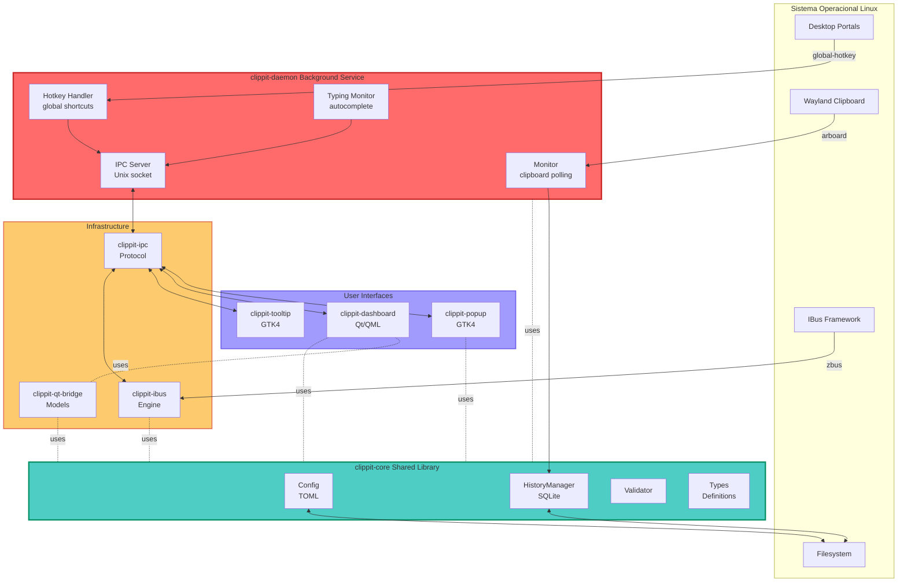
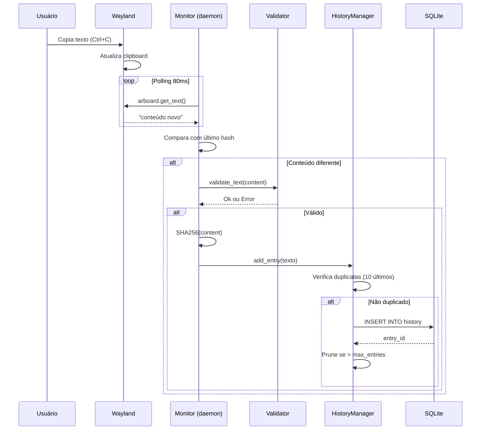
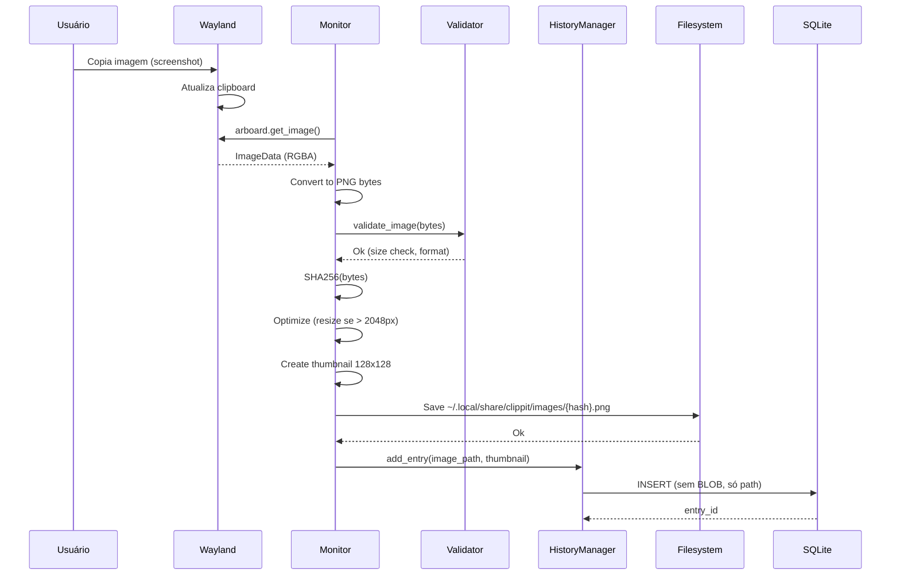
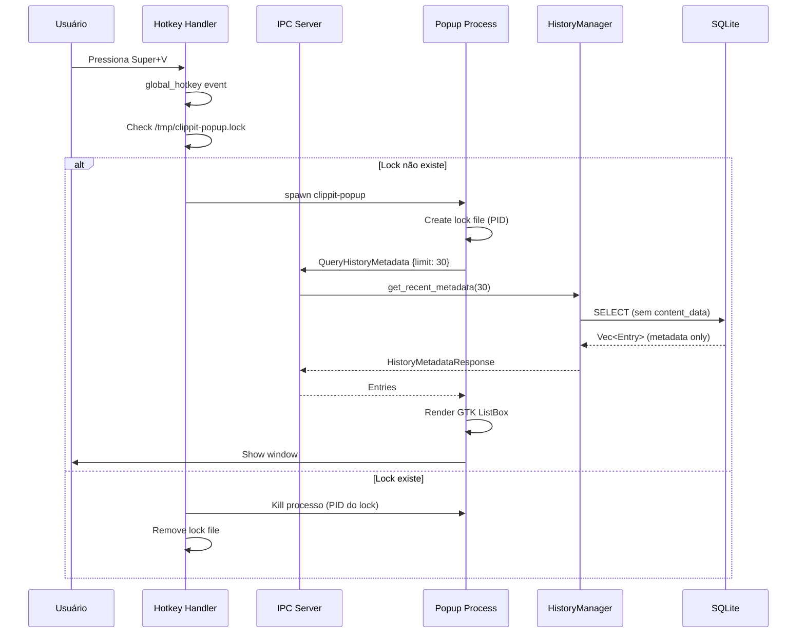
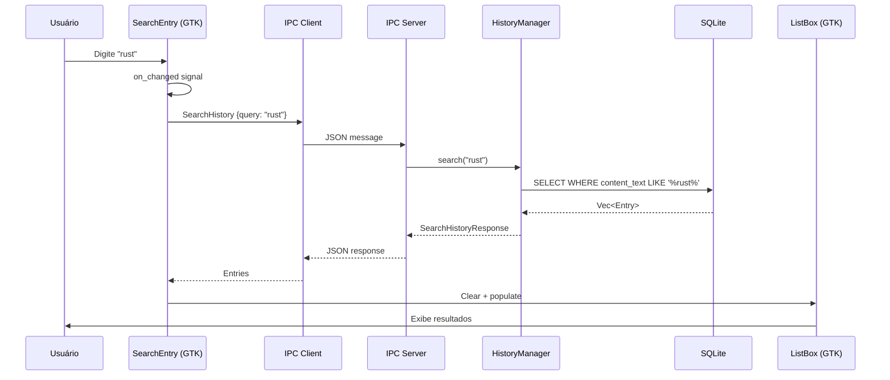
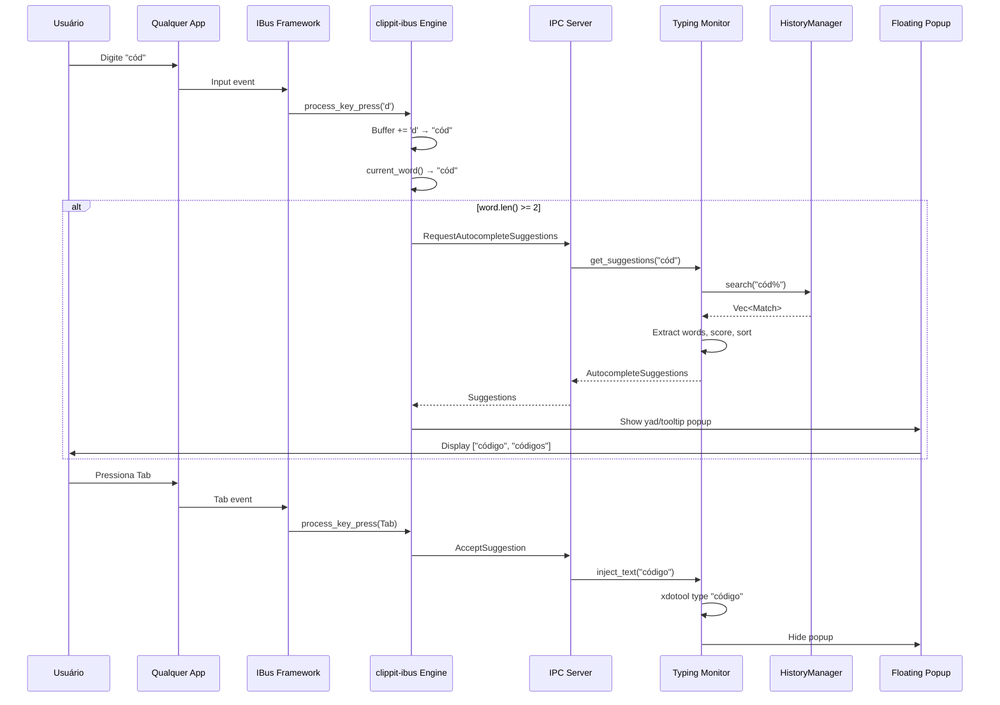

# Arquitetura Detalhada - Clippit

## 📐 Visão Geral Arquitetural

Clippit segue uma **arquitetura de microserviços modular** onde:
- Um **daemon central** gerencia o estado e coordena operações
- Múltiplos **clientes UI** se comunicam via IPC
- **Separação clara** entre lógica de negócio, apresentação e infraestrutura

## 🏗️ Diagrama de Componentes



## 📦 Arquitetura em Camadas

### Layer 1: System Integration
```
┌─────────────────────────────────────────┐
│   Sistema Operacional (Linux)          │
│   - Wayland/X11 Clipboard               │
│   - Desktop Portals (hotkeys)          │
│   - IBus Framework (input method)      │
│   - Filesystem (SQLite, images, config)│
└─────────────────────────────────────────┘
                    ▲
                    │ Native APIs
                    ▼
```

### Layer 2: Core Library (Shared Business Logic)
```
┌─────────────────────────────────────────┐
│         clippit-core                    │
│                                         │
│  ┌──────────┐  ┌──────────┐            │
│  │ Config   │  │ History  │            │
│  │ Manager  │  │ Manager  │            │
│  └──────────┘  └──────────┘            │
│                                         │
│  ┌──────────┐  ┌──────────┐            │
│  │ Types &  │  │Content   │            │
│  │ Traits   │  │Validator │            │
│  └──────────┘  └──────────┘            │
└─────────────────────────────────────────┘
                    ▲
                    │ Library API
                    ▼
```

### Layer 3: Service Layer (Daemon)
```
┌─────────────────────────────────────────┐
│       clippit-daemon (Service)          │
│                                         │
│  ┌──────────────────┐                  │
│  │ Clipboard Monitor│ ← Polling 80ms   │
│  └──────────────────┘                  │
│                                         │
│  ┌──────────────────┐                  │
│  │ Hotkey Handler   │ ← Global hooks   │
│  └──────────────────┘                  │
│                                         │
│  ┌──────────────────┐                  │
│  │ Typing Monitor   │ ← rdev events    │
│  └──────────────────┘                  │
│                                         │
│  ┌──────────────────┐                  │
│  │ IPC Server       │ ← Unix socket    │
│  └──────────────────┘                  │
└─────────────────────────────────────────┘
                    ▲
                    │ IPC Protocol (JSON)
                    ▼
```

### Layer 4: Infrastructure
```
┌─────────────────────────────────────────┐
│         Infrastructure Layer            │
│                                         │
│  ┌──────────┐  ┌──────────┐            │
│  │clippit-  │  │clippit-  │            │
│  │ipc       │  │ibus      │            │
│  └──────────┘  └──────────┘            │
│                                         │
│  ┌──────────┐                          │
│  │clippit-  │                          │
│  │qt-bridge │                          │
│  └──────────┘                          │
└─────────────────────────────────────────┘
                    ▲
                    │
                    ▼
```

### Layer 5: Presentation (UI Clients)
```
┌─────────────────────────────────────────┐
│        Presentation Layer               │
│                                         │
│  ┌──────────┐  ┌──────────┐            │
│  │clippit-  │  │clippit-  │            │
│  │popup     │  │dashboard │            │
│  │(GTK4)    │  │(Qt/QML)  │            │
│  └──────────┘  └──────────┘            │
│                                         │
│  ┌──────────┐                          │
│  │clippit-  │                          │
│  │tooltip   │                          │
│  └──────────┘                          │
└─────────────────────────────────────────┘
```

## 🔄 Fluxos de Dados Detalhados

### Fluxo 1: Captura de Clipboard (Texto)



### Fluxo 2: Captura de Imagem



### Fluxo 3: Abertura do Popup



### Fluxo 4: Busca em Tempo Real



### Fluxo 5: Autocomplete Global



## 🗄️ Modelo de Dados

### SQLite Schema

```sql
-- Tabela principal
CREATE TABLE clipboard_history (
    id INTEGER PRIMARY KEY AUTOINCREMENT,
    content_type TEXT NOT NULL,           -- "Text" ou "Image"
    content_text TEXT,                    -- Conteúdo se texto
    content_data BLOB,                    -- DEPRECATED (legacy)
    image_path TEXT,                      -- Path para arquivo PNG
    thumbnail_data BLOB,                  -- Thumbnail 128x128
    timestamp TEXT NOT NULL               -- RFC3339 UTC
);

-- Índice para queries rápidas
CREATE INDEX idx_timestamp ON clipboard_history(timestamp DESC);

-- Query comum: últimas 100 entradas
SELECT id, content_type, content_text, image_path, thumbnail_data, timestamp
FROM clipboard_history
ORDER BY timestamp DESC
LIMIT 100;

-- Query de busca
SELECT * FROM clipboard_history
WHERE content_text LIKE '%query%' OR image_path LIKE '%query%'
ORDER BY timestamp DESC;
```

### Estruturas Rust Principais

```rust
// clippit-core/src/types.rs
pub enum ContentType {
    Text,
    Image,
}

pub struct ClipboardEntry {
    pub id: i64,
    pub content_type: ContentType,
    pub content_text: Option<String>,
    pub content_data: Option<Vec<u8>>,      // Legacy
    pub image_path: Option<String>,
    pub thumbnail_data: Option<Vec<u8>>,
    pub timestamp: DateTime<Utc>,
}

// clippit-ipc/src/protocol.rs
pub enum IpcMessage {
    QueryHistory { limit: usize },
    QueryHistoryMetadata { limit: usize, offset: usize },
    SearchHistory { query: String },
    GetEntryData { id: i64 },
    SelectItem { id: i64 },
    RequestAutocompleteSuggestions { 
        partial_word: String, 
        context: AppContext,
        max_results: usize 
    },
    AcceptSuggestion { 
        suggestion: String, 
        partial_word: String 
    },
    // ...
}

pub enum IpcResponse {
    Ok,
    Error { message: String },
    HistoryResponse { entries: Vec<HistoryEntry> },
    HistoryMetadataResponse { entries: Vec<HistoryEntry> },
    SearchHistoryResponse { entries: Vec<HistoryEntry> },
    AutocompleteSuggestions { 
        suggestions: Vec<Suggestion>, 
        query: String 
    },
    // ...
}
```

## 🔐 Considerações de Segurança

### 1. Validação de Inputs
- **Texto**: Máximo 10MB, UTF-8 válido
- **Imagem**: Máximo 50MB, formatos PNG/JPEG
- **Paths**: Canonicalizados antes de uso

### 2. SQL Injection Protection
- Uso exclusivo de **prepared statements**
- Parâmetros sempre passados via bindings

### 3. IPC Security
- Socket Unix local (`/tmp/clippit.sock`)
- Permissões: apenas owner pode conectar
- Sem autenticação (local user trust)

### 4. Privacidade
- Apps ignorados configuráveis (password managers)
- Histórico local (não sincronizado por padrão)
- Opção de limpar histórico

### 5. Resource Limits
- Max 100 entradas por padrão
- Pruning automático
- Memory limits em buffers

## ⚡ Otimizações de Performance

### 1. Database
- **Índice em timestamp**: Queries ordenadas rápidas
- **Metadata queries**: Sem carregar BLOBs desnecessários
- **Batch operations**: Pruning em lote

### 2. Images
- **Filesystem storage**: Não infla banco SQLite
- **Hash deduplication**: SHA256 evita duplicatas
- **Thumbnails**: Preview rápido sem carregar imagem completa
- **Lazy loading**: Carrega imagem completa só quando necessário

### 3. IPC
- **JSON streaming**: Uma mensagem por linha
- **Selective queries**: Metadata vs full data
- **Connection pooling**: Reutiliza conexões

### 4. UI
- **Infinite scroll**: Carrega 30 itens iniciais + 20 on-demand
- **Skeleton loaders**: Feedback visual durante carregamento
- **Debounce**: Busca com 300ms delay
- **Virtual scrolling**: Renderiza apenas itens visíveis

### 5. Autocomplete
- **Cache**: Top 1000 palavras em memória
- **Buffer stale**: Limpa após 5s inatividade
- **Throttle**: Mínimo 2 caracteres para sugerir

## 🔄 Padrões de Concorrência

### Tokio Async Runtime
```rust
// daemon/main.rs
#[tokio::main]
async fn main() {
    let history = Arc::new(Mutex::new(HistoryManager::new()));
    
    // Task 1: Clipboard monitor
    let h1 = history.clone();
    tokio::spawn(async move {
        monitor::start_monitor(h1).await;
    });
    
    // Task 2: Hotkey handler
    let h2 = history.clone();
    tokio::spawn(async move {
        hotkey::start_hotkey_handler(h2).await;
    });
    
    // Task 3: IPC server (main thread)
    ipc_server.run(history).await;
}
```

### Thread Safety
- `Arc<Mutex<>>` para shared state
- `tokio::sync::mpsc` para channels
- Lock granularity mínima

## 🔗 Links para Documentação Relacionada

- **Visão Geral**: [00-PROJECT-OVERVIEW.md](./00-PROJECT-OVERVIEW.md)
- **Padrões de Desenvolvimento**: [02-DEVELOPMENT-STANDARDS.md](./02-DEVELOPMENT-STANDARDS.md)
- **IPC Protocol**: [infrastructure/IPC-PROTOCOL.md](./infrastructure/IPC-PROTOCOL.md)
- **History Storage**: [core/HISTORY-STORAGE.md](./core/HISTORY-STORAGE.md)

---

**Versão**: 1.0  
**Data**: 2026-01-28
